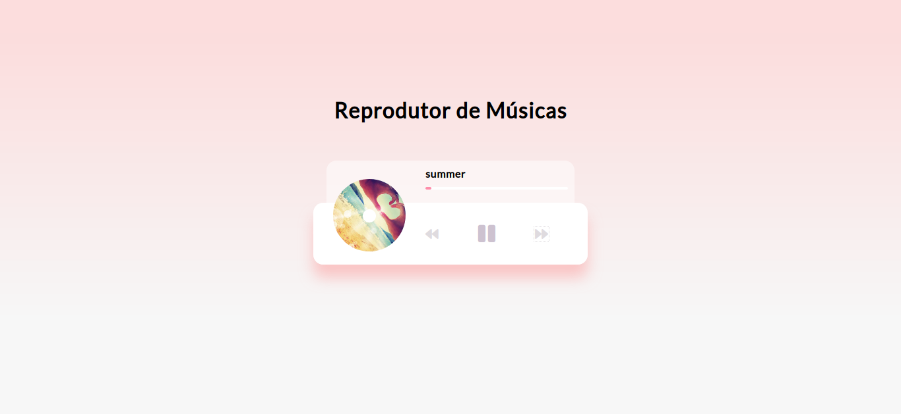

# music-player

## Project

***EN:*** This project is a personalized music player with an attractive UI that plays the songs stored in the "music" directory at the root of the project using the HTML5 audio API.

***PT-BR:*** Este projetinho é um reprodutor de músicas personalizado com uma UI atrativa que toca as músicas armazenadas no diretório "music" na raiz do projeto utilizando a HTML5 audio API.

### Specifications
- Create UI for music player including spinning image and song detail popup
- Add play and pause functionality
- Insert switch songs functionality
- Add progress bar
***

## Technologies

This project was developed with the following technologies:

- HTML
- CSS
- JavaScript
***
 
## Preview

***

## License

This project is under the MIT license.
